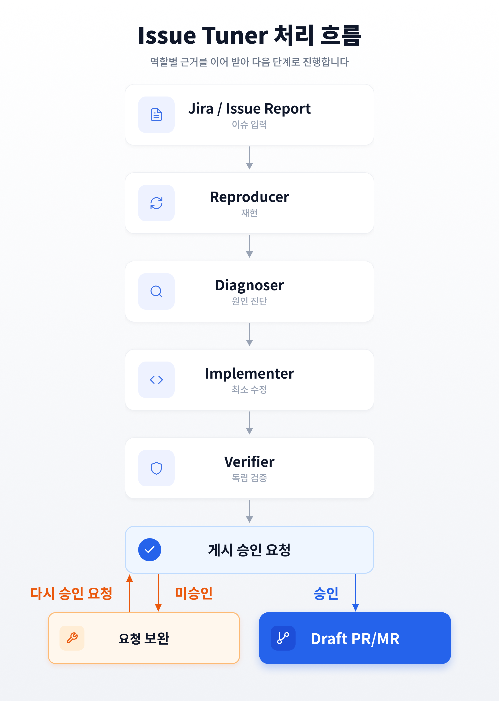

# Issue Tuner

Issue Tuner는 Codex에서 이슈 재현부터 Draft PR/MR 준비까지 이어 주는 Marketplace Plugin입니다. 현재 Codex 기준으로 만들었으며 Claude 지원은 준비 중입니다.

Jira connector가 설치되어 있으면 Jira 키나 URL로 이슈를 조회합니다. connector가 없을 때는 Issue Report Form JSON을 입력받습니다. Jira에 종속된 도구는 아닙니다.

## 지원 범위

- macOS의 Codex
- Jira 키·URL 또는 범용 Issue Report Form
- Python 표준 라이브러리로 동작하는 안전 게이트
- 저장소별 격리 worktree, 검증 결과, commit gate, Draft PR/MR
- 선택적 Serena MCP: `uvx`가 첫 사용 시 자동 준비

UI 검증에는 Codex host의 `Computer Use`를 먼저 씁니다. 사용할 수 없거나 차단되면 자동화 실패를 기록하고 **사용자 직접** 재현 또는 검증을 요청합니다. 사용자가 명확하게 확인하면 `user_confirmed` 근거와 한계를 남깁니다. 재현 확인만으로 게시가 승인되지는 않습니다.

## 처리 흐름



## 설치

필수 도구는 Git, Python 3, Codex, `uv`입니다.

```sh
brew install uv
git clone https://github.com/devseongeun/issue-tuner.git
cd issue-tuner
codex plugin marketplace add "$PWD"
codex plugin add issue-tuner@issue-tuner
```

`.mcp.json`의 Serena는 선택 기능입니다. Codex가 MCP를 시작할 때 `uvx`가 고정된 버전을 준비하므로 전역 설치는 필요하지 않습니다. Serena를 쓸 수 없으면 Skill은 Codex 검색과 `rg`로 작업을 이어 가되 근거 수준을 낮춰 기록합니다.

## 사용

Codex에 Jira 키나 URL을 전달합니다. [`plugins/issue-tuner/examples/issue-report.json`](plugins/issue-tuner/examples/issue-report.json)을 복사해 값을 채운 뒤 다음처럼 요청해도 됩니다.

> `$issue-tuner`로 이 Issue Report를 재현하고 진단해줘.

Issue Tuner는 `Reproducer` → `Diagnoser` → `Implementer` → `Verifier`로 역할을 나눠 재현, 진단, 최소 수정, 독립 검증을 수행합니다.

Issue Report Form의 핵심 항목은 다음과 같습니다.

- 기대 결과, 실제 결과, 재현 단계
- 제품과 제품 버전, 사업 맥락(선택)
- 환경 이름과 대상 주소
- 저장소 경로와 현재 브랜치
- 이슈 유형에 맞는 검증 채널

입력 계약은 다음 명령으로 확인합니다.

```sh
python3 plugins/issue-tuner/scripts/validate_contract.py issue-report plugins/issue-tuner/examples/issue-report.json
```

대상 저장소의 `.issue-tuner.json`은 앱 runtime의 시작 명령과 준비 확인 경로를 선언합니다. [예제 설정](plugins/issue-tuner/examples/.issue-tuner.json)을 복사해 대상 저장소에 두고 실제 명령에 맞게 수정하세요. 파일이 없으면 Issue Tuner가 값을 추론하지 않고 사용자에게 확인합니다.

## 안전 승인

Issue Tuner는 준비 단계 확인과 게시 승인을 분리합니다. 검증이 끝나면 exact stage 파일, 제외 변경, commit message, 현재 브랜치 push, Draft 생성 범위를 제시하고 **한 번의 최종 게시 승인**을 요청합니다. 바로 이어진 명확한 긍정 답변만 stage → gate check → commit → 현재 branch push → Draft PR/MR의 연속 실행을 승인합니다. 승인받지 못하면 요청 내용을 보완한 뒤 게시 승인을 다시 요청합니다.

승인에 포함되지 않는 작업은 force push, merge, deploy, 수동 pipeline 실행, reviewer 변경입니다. production 환경에서는 승인이 있어도 read-only 관찰, snapshot, 비변경 log 확인만 허용합니다.

## 증거 보존

실행 원본과 결과는 저장소 밖의 `~/.issue-tuner/runs/<run-id>/`에 보존합니다. `ISSUE_TUNER_HOME`을 절대 경로로 지정하면 보존 위치가 바뀝니다. 원본 Issue Report와 실행 evidence는 자동으로 삭제하거나 공개 저장소에 복사하지 않습니다. public safety gate는 공개 저장소에 들어갈 파일과 민감 정보를 제거한 Draft 본문만 검사합니다.

## 개발

기여 방법은 [CONTRIBUTING.md](CONTRIBUTING.md), 보안 정책은 [SECURITY.md](SECURITY.md), 설계 경계는 [docs/design.md](docs/design.md)를 참고하세요.

## 라이선스

[MIT](LICENSE)
